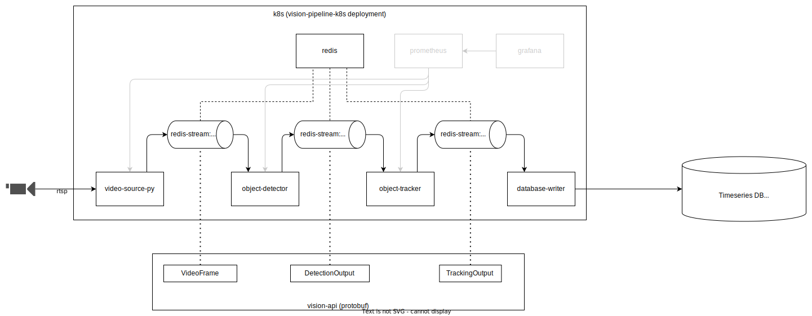

# Architecture
The diagram below shows the deployment of a vision pipeline / SAE instance. 
A video stream is ingested through one or multiple video sources, which decode the stream and create
`VideoFrame` proto objects which are then serialized into base64 and pushed onto a Redis stream.
The object detector consumes these `VideoFrame` objects, detects objects on them, wraps the `VideoFrame` 
into a `DetectionOutput` and pushes those onto another Redis stream. The object tracker consumes these 
objects from Redis and tries to reassociate detected objects with previous observations, assigning an ID.
The result is pushed onto the Redis stream in the form of `TrackingOutput` objects.
The output is consumed by the database writer, which deserializes the messages and writes only the metadata
into a TimescaleDB (or a regular Postgres).

# Technical Details