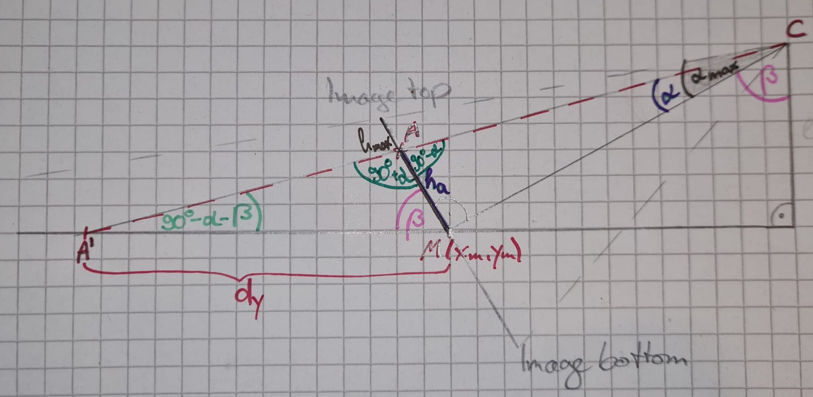
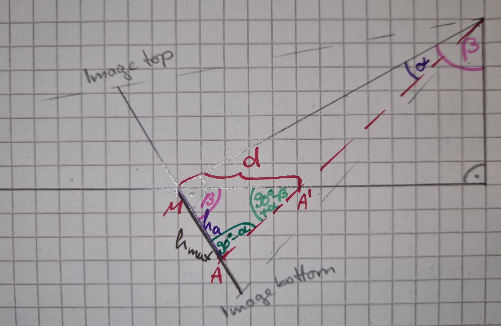
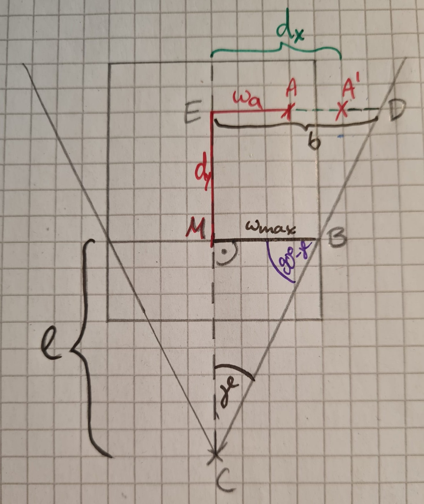
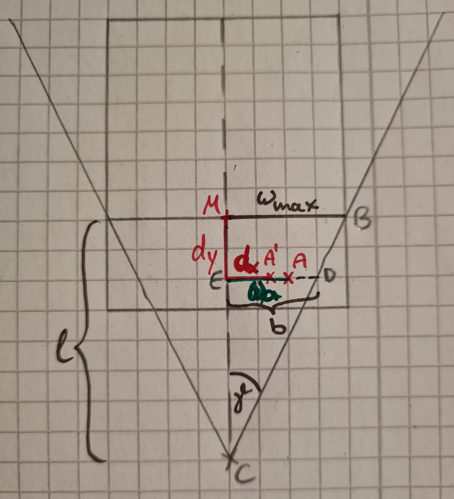

# Transforming Pixel to Geo Coordinates

- Transformation of a point A from the camera perspective to position A' in the top view
- Considerations:
    - the new height of a point is independent of the point's width in the image
        - assume the camera is on same horizontal level as the ground (not tilted)
        - assume the ground is flat
    - the new width is dependent on the height: two points with the same width difference in the original image are, in reality, closer together if they are closer to the bottom of the image
- Approach:
    - calculate the new height y' first.
    - given y', calculate the new width x'.
    - distances of points (x', y') in the transformed space scale linearly with geocoordinates.
    - transform *two* reference points, whose geocoordinates are known:
      - so we can translate the distances in the transformed space to distances in geocoordinates
      - calculate the length of a distance of 1 in transformed space in terms of geocoordinates

### Transformation of y Coordinate

side perspective:

- Point $C$ is the camera
- middle point $M$ stays the same: $M=(x_m, y_m)=(x'_m, y'_m) = M'$
- information we need from the camera: 
  - half of the camera angle (from up to down): $\alpha_{max}$
  - Angle at which the camera points toward the ground: $\beta$
- what we can easily get from the image: 
  - the half of the image height in pixels: $h_{max}$
  - the height difference of point $A$ to the middle point $M$: $h_a$

##### Point A above Middle Point

- calculate $\alpha$ from $h_a$, $h_{max}$ and $\alpha_{max}$
- $y'_a = y_m + d_y$
- law of sines in triangle $AMA'$: $\frac{d_y}{\sin{(90°+\alpha)}}=\frac{h_a}{\sin{(90°-\alpha-\beta)}} \Rightarrow d_y = h_a\cdot\frac{\sin{(90°+\alpha)}}{\sin{(90°-\alpha-\beta)}}$

$y'_a = y_m + h_a\cdot\frac{\sin{(90°+\alpha)}}{\sin{(90°-\alpha-\beta)}}$

##### Point A below Middle Point

- $y'_a = y_m - d_y$
- law of sines in triangle $AMA'$: $\frac{d_y}{\sin{(90°-\alpha)}}=\frac{h_a}{\sin{(90°+\alpha-\beta)}} \Rightarrow d_y = h_a\cdot\frac{\sin{(90°-\alpha)}}{\sin{(90°+\alpha-\beta)}}$

$y'_a = y_m - h_a\cdot\frac{\sin{(90°-\alpha)}}{\sin{(90°+\alpha-\beta)}}$

### Transformation of x Coordinate

top view:

- information we need from the camera: 
  - half of the camera angle (from left to right): $\gamma$
- what we can easily get from the image: 
  - the half of the image width in pixels: $w_{max}$
  - the width difference of point $A$ to the middle point $M$: $w_a$
- what we already know from previous calculation:
  - heigth distance of A' to M: $d_y$ 

##### Calculations

- in triangle $MCB$: $\tan{\gamma}=\frac{w_{max}}{l} \Rightarrow l = \frac{w_{max}}{\tan{\gamma}}$
- if A is right of M: $x'_a = x_m + d_x$ else: $x'_a = x_m - d_x$

##### Point A above Middle Point

- similar triangles $MCB$ and $ECD$: $\frac{w_{max}}{l} = \frac{b}{l+d_y} \Rightarrow b = w_{max}\cdot(1+\frac{d_y}{l})$
- stretching: $\frac{w_a}{w_{max}}=\frac{d_x}{b} \Rightarrow d_x = \frac{b\cdot w_a}{w_{max}} = w_a\cdot(1+\frac{d_y}{l})$

$x'_a = x_m \plusmn w_a\cdot(1+\frac{d_y\cdot\tan\gamma}{w_{max}})$

##### Point A below Middle Point

- similar triangles $MCB$ and $ECD$: $\frac{w_{max}}{l} = \frac{b}{l-d_y} \Rightarrow b = w_{max}\cdot(1-\frac{d_y}{l})$
- stretching: $\frac{w_a}{w_{max}}=\frac{d_x}{b} \Rightarrow d_x = \frac{b\cdot w_a}{w_{max}} = w_a\cdot(1-\frac{d_y}{l})$

$x'_a = x_m \plusmn w_a\cdot(1-\frac{d_y\cdot\tan\gamma}{w_{max}})$